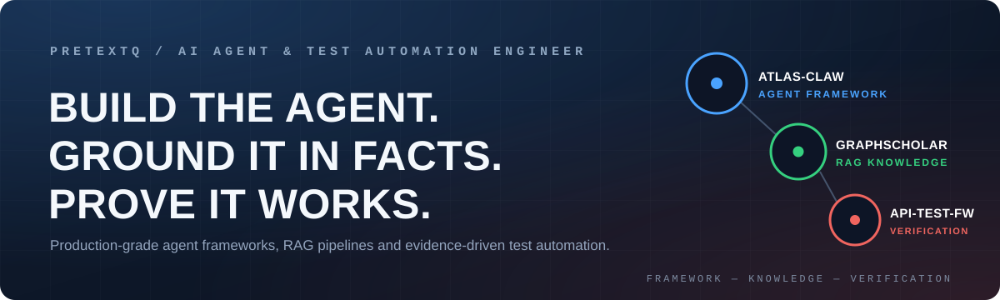

[简体中文](README.md) · [English](README.en.md)

# Hi, I'm pretextQ 👋

---

**I don't build chat demos — I build permission-controlled, verifiable, production-ready systems.**

AI Agent Framework · RAG · API Test Automation · DevOps Engineering

[GitHub](https://github.com/pretextQ)

---

## Projects

| Project | Description |
| --- | --- |
| **[atlas-claw](https://github.com/pretextQ/atlas-claw)** | Enterprise AI Agent framework: one unified conversational entry point across CRM, ITSM, monitoring, HR, finance and OA. Thin core + pluggable providers, strict RBAC inheritance, embedded and standalone deployment modes |
| **[api-auto-test-framework](https://github.com/pretextQ/api-auto-test-framework)** | Pytest-based API test framework for microservices: YAML data-driven + chain context passing, JSONPath & MySQL dual validation, Allure reports, Feishu notifications, Docker & GitHub Actions CI |
| **[GraphScholarV1](https://github.com/pretextQ/GraphScholarV1)** | Multimodal RAG QA system for personal knowledge management: BM25 + vector hybrid retrieval, query rewrite → routing → rerank → citation checking |

## Tech Stack

## GitHub Stats

---

*Code is the source of truth; engineering is the discipline.*

