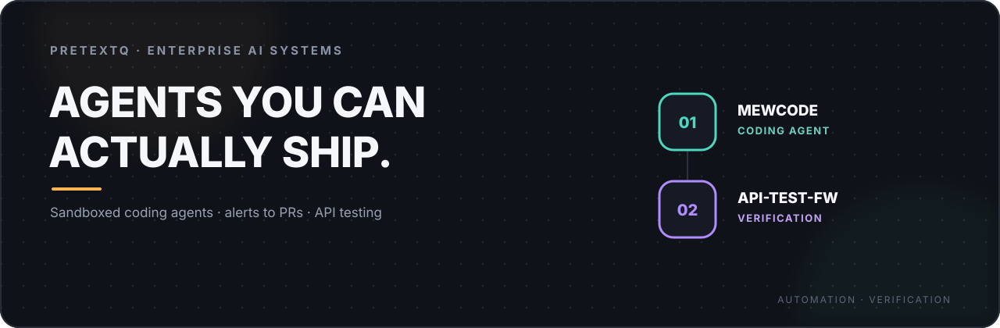

<p align="center">
  
</p>

<p align="center">
  <a href="./README.md">简体中文</a>
  ·
  <strong>繁體中文</strong>
  ·
  <a href="./README.en.md">English</a>
</p>

<h1 align="center">你好，我是 pretextQ 👋</h1>

<h3 align="center">我建構的不是「會跑的 Demo」，而是權限可控、結果可驗證、能落進企業生產環境的系統。</h3>

<p align="center">
  AI Agent Framework · Enterprise RBAC · Coding Agent 與告警自動化 · 介面自動化測試 · DevOps 工程化
</p>

<p align="center">
  <a href="https://github.com/pretextQ">GitHub</a>
</p>

---

## 三個儲存庫，一條完整的工程鏈路

我習慣把「能不能落進企業生產環境」當作系統的第一指標：模型只是其中的判斷元件，真正決定成敗的，是權限邊界、工具與上下文治理、驗證手段和可觀測性。

這三個專案恰好覆蓋了我最關心的完整工程鏈路：

<table>
  <tr>
    <td width="33%" valign="top">
      <strong>⚙️ Agent Framework</strong><br/><br/>
      Agent 如何以登入使用者的身分、在企業權限體系內呼叫內部系統：統一入口、權限繼承、可插拔整合、Trace 與稽核。
    </td>
    <td width="33%" valign="top">
      <strong>🧩 Coding Agent</strong><br/><br/>
      AI Coding Agent 如何無人值守地把線上告警變成可人審的修復 PR：OS 級沙箱、唯讀工具鏈、結構化證據鏈與有界重試。
    </td>
    <td width="33%" valign="top">
      <strong>🛡️ Verification / Testing</strong><br/><br/>
      如何證明系統行為正確：YAML 資料驅動、介面與資料庫雙重校驗、持續迴歸與 CI 閉環。
    </td>
  </tr>
</table>

```text
atlas-claw              →  企業 Agent 的統一入口、權限繼承與可插拔整合
MewCode                 →  告警進來、PR 出去：沙箱裡的無人值守修復
api-auto-test-framework →  用資料驅動與雙重校驗證明每一次介面行為
```

---

## 01 / atlas-claw

### [An enterprise Agent framework with a thin core](https://github.com/pretextQ/atlas-claw)

> 讓 Agent 以登入使用者的身分、在企業權限體系內呼叫內部系統完成任務——而不是在平台層散落硬編碼整合。

| 專案形態 | 核心定位 | 目前狀態 | Links |
|---|---|---|---|
| 企業級 AI Agent 框架 | 統一入口 · RBAC 繼承 · 可插拔 Provider | v0.1.0-alpha · 活躍開發 | [Repository](https://github.com/pretextQ/atlas-claw) |

atlas-claw 是面向企業場景的 AI Agent 框架：用一個統一對話入口打通 CRM、ITSM、監控、HR、財務、OA 等內部系統。平台層保持薄核心，只負責路由、鑑權與編排；具體系統接入全部做成可插拔 Provider。

### 讓 Agent 真正落進企業內部網路

```text
使用者（企業帳號 / JWT）
      ↓
FastAPI 服務層 ── 對話 · 稽核 · Trace 落庫
      ↓
Agent 編排（薄核心）
      ↓
可插拔 Provider
      ↓
CRM · ITSM · 監控 · HR · 財務 · OA
```

- **統一對話入口**：一個入口串聯多個內部系統，使用者不需要知道背後接了哪個 Provider。
- **嚴格繼承 RBAC 權限**：對話身分即系統身分，唯讀使用者只能看見自己有權限的系統與資料。
- **薄核心 + 可插拔 Provider**：新系統接入寫成獨立 Provider，內部直呼叫既有介面，不在平台層堆積硬編碼整合。
- **內嵌 / 獨立兩種部署**：既可嵌進企業現有系統共享使用者與組織架構，也可獨立部署在內部網路自託管。
- **可觀測與可稽核**：每次 Provider 呼叫的參數、耗時、狀態碼落庫成 Trace，附稽核報表、失敗率與耗時分析。
- **為測試而設計**：核心不綁定具體模型，CI 中以固定 Stub Provider 跑端到端迴歸。

### 這個專案真正要解決的問題

Agent 在企業裡最常見的失敗不是「不夠聰明」，而是權限失控、整合散落、行為無法追溯。atlas-claw 把這三件事放在設計起點：讓模型的每一次行動都在既有權限體系內、有 Trace 可查、可被報表統計。

**Core Stack**

`Python` `FastAPI` `SQLAlchemy` `JWT / RBAC` `SQLite / MySQL / PostgreSQL` `Docker Compose` `GitHub Actions`

---

## 02 / MewCode

### [An AI Coding Agent that turns alerts into reviewed PRs](https://github.com/pretextQ/MewCode)

> 同一個 agent 核心，兩種形態：互動式 CLI/TUI 幫你寫程式碼；無頭服務常駐接線上告警——agent 在 OS 級沙箱裡定位、修復、驗證，以 PR 交給人工 review。人審 PR 是唯一必經的人工節點，服務沒有任何 merge 權限。

| 專案形態 | 核心定位 | 信任邊界 | Links |
|---|---|---|---|
| AI Coding Agent + 告警驅動的自動化開發服務 | 告警 → 修復 PR · OS 級沙箱 · 有界重試 | 人審 PR 唯一關卡 · 服務無 merge 權限 | [Repository](https://github.com/pretextQ/MewCode) |

MewCode 把「收到告警 → 定位 → 修復 → 驗證 → 提交 review」這條值班鏈路自動化：Alertmanager webhook 觸發，每個 job 在獨立沙箱與 git worktree 中執行，PR body 自帶結構化證據鏈——告警摘要、根因、測試前後對比、整合驗證——審查者不看 agent 日誌也能做判斷。真機評估集回放 6 單全部無人值守跑通：修復 PR 成功率 100%，告警→PR 中位數 25–26 秒。

### 從告警到 PR 的無人值守鏈路

```text
告警（Alertmanager webhook）
      ↓
服務層 ── SQLite 狀態機 · 指紋去重 · 重啟恢復
      ↓
每 job 隔離單元（git worktree + Docker 沙箱）
      ↓
Agent 核心 ── 定位 · 修復 · 有界重試（超限 escalate）
      ↓
驗證 ── 迴歸測試 + 自起 docker-compose 整合測試
      ↓
PR + CI 關卡 ─▶ 人工 review（唯一上線關卡）
```

- **告警進來，PR 出去**：demo 儲存庫保留歷次無人值守執行的真實 PR，每份都是完整證據鏈，可從 [PR #5](https://github.com/pretextQ/mewcode-alert-demo/pull/5) 看起。
- **修不好就誠實升級**：重試有上限，超限進入 escalate 並附上已嘗試的分析；驗證不過的修復不會被發布，絕不產生垃圾 PR。
- **OS 級沙箱**：agent 在容器內執行——非 root、全部能力丟棄、唯讀根檔案系統、CPU/記憶體/PID 限制、硬逾時強制終止，宿主設定與金鑰不進容器。
- **內部工具鏈唯讀**：內建生產日誌（Loki）與 CI 狀態（GitHub）兩個 MCP server，讀取路徑只有 GET；未聲明 readOnlyHint 的工具在服務模式一律不掛。
- **自起測試環境**：儲存庫帶 docker-compose.yml 時自動啟動依賴，在沙箱內跑整合測試；無容器執行環境則如實記錄「未執行」，不用假驗證充數。
- **營運可量化**：/metrics（Prometheus）、單 job JSON 複盤、按儲存庫 token 成本；評估集回放讓每次提示詞/核心改動都有成功率、MTTR 與成本的前後對比。
- **多儲存庫策略**：`.mewcode/policy.yaml` 聲明觸發路由、目標分支、token 預算與通知管道，按 job 即時讀取、改檔案即生效，損壞的策略快速失敗而非靜默回退。
- **互動式核心同樣完整**：工具集 + 權限分層管線（deny 優先於白名單）+ Skill 與 MCP 擴充，Windows 是一等公民平台。

### 這個專案真正要解決的問題

無人值守寫程式碼最難的不是「修得快」，而是「憑什麼信」：權限怎麼收斂、行為怎麼隔離、證據怎麼沉澱、改壞了怎麼保證不上線。MewCode 把信任當成設計起點——headless 模式下「要問人」的動作一律拒絕而非放行，PR 是唯一出口，人是唯一關卡。

**Core Stack**

`Python 3.11` `Textual` `asyncio` `Docker 沙箱` `MCP` `Prometheus` `SQLite` `GitHub Actions`

---

## 03 / api-auto-test-framework

### [YAML-driven API testing with dual validation](https://github.com/pretextQ/api-auto-test-framework)

> 用 YAML 資料驅動 + 雙重校驗，把介面測試做成可以持續迴歸的工程資產，而不是一次性腳本。

| 專案形態 | 資料驅動 | 校驗方式 | Links |
|---|---|---|---|
| 介面自動化測試框架 | YAML 用例 | JSONPath + SQL | [Repository](https://github.com/pretextQ/api-auto-test-framework) |

基於 Pytest 的微服務介面自動化測試框架：克隆、裝依賴、`pytest` 三步跑通，不需要額外設定腳本。單 YAML 檔案即可覆蓋單介面冒煙、異常斷言與多步依賴鏈路。

### 把介面測試做成可迴歸的工程資產

```text
YAML 用例（單介面 / 異常 / 鏈路）
      ↓
Pytest 執行引擎 + 上下文傳參（extract → 模板）
      ↓
JSONPath 回應斷言  +  SQL 資料校驗
      ↓
Allure 報告 · 飛書結果通知
      ↓
Docker 化執行 · GitHub Actions CI
```

- **YAML 資料驅動**：用例即文件，單檔案覆蓋冒煙、異常與多步鏈路場景。
- **鏈路上下文傳參**：extract 提取 + 參數模板，跨介面取數像讀句子一樣自然。
- **JSONPath + SQL 雙重校驗**：介面回應與資料庫狀態同時斷言，防住「回傳 200 但資料沒落庫」這類問題。
- **多環境切換**：conftest 管理環境組態，一套用例跑遍開發、測試、預發。
- **結果工程閉環**：Allure 報告、飛書機器人通知、Docker 化執行、GitHub Actions CI 全部就位。

### 這個專案真正要解決的問題

自動化測試的價值不在跑得多，而在失敗時能否直接定位、成功時能否信任。回應與資料庫的雙重校驗、清晰的分層結構，讓每一次斷言都可解釋、可維護。

**Core Stack**

`Python` `Pytest` `YAML` `JSONPath` `SQL` `Allure` `Docker` `GitHub Actions` `飛書`

---

## 貫穿三個專案的工程原則

| 原則 | 我的工程取向 |
|---|---|
| **權限先行** | Agent 以登入使用者身分行動，RBAC 決定能看見什麼、呼叫什麼，未授權的整合不進平台層。 |
| **Evidence before answers** | 回答要有依據、斷言要有資料、發現要有證據，不輸出無法回溯的結論。 |
| **薄核心，可替換** | 框架、Agent 內核、測試都以薄核心組織，具體實作做成可插拔元件。 |
| **可觀測與可稽核** | Trace、稽核報表、Allure 報告先於功能堆疊，行為可重放、可統計。 |
| **一切進 CI** | Stub 迴歸、pytest + ruff + mypy 檢查、容器化執行都進 GitHub Actions，文件與程式碼同步演進。 |

## 技術分層

| Layer | Technologies | What I build |
|---|---|---|
| **Agent & Backend** | Python, FastAPI, SQLAlchemy, JWT / RBAC | 服務層、領域模型、權限繼承與對話管理 |
| **Agent Internals** | Textual, asyncio, MCP, Docker, Prometheus | Agent 核心、權限分層、沙箱執行與告警服務化 |
| **Testing & Quality** | Pytest, YAML, JSONPath, SQL, ruff, mypy | 介面迴歸、雙重校驗、靜態型別與風格檢查 |
| **Delivery & Ops** | Docker, Docker Compose, GitHub Actions, Allure, 飛書 | CI、環境編排、報告與結果通知 |

## 最近在做的事

- 打磨 atlas-claw 的內嵌 / 獨立雙模式，擴充內部系統的 Provider 與稽核報表
- 打磨 MewCode 的沙箱 egress 白名單與告警觸達，擴充評估集用例
- 沉澱 api-auto-test-framework 的校驗器與用例庫

---

<h3 align="center">Agents you can actually ship.</h3>

<p align="center">
  如果你也在做企業 Agent 落地、Coding Agent 原理實作或測試工程化，歡迎交流。
</p>

<p align="center">
  <a href="https://github.com/pretextQ">Explore my repositories</a>
</p>
